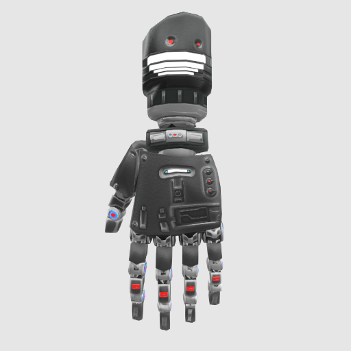

# Cyber hands

Hand model  "[CYBER ARM PAINTED](https://skfb.ly/owHGo)" by Idemthal,  licensed under Creative Commons Attribution (http://creativecommons.org/licenses/by/4.0/).

Model has been reduced and simplified for VR. Rigging and skinning done in Blender.

Joint structure based on the [generic-hand](https://github.com/immersive-web/webxr-input-profiles/tree/main/packages/assets/profiles/generic-hand) assets from [immersive-web/webxr-input-profiles](https://github.com/immersive-web/webxr-input-profiles).

# Usage Notes
 * Includes an emissive map. In case emission isn't supported in the renderer, it's best to remove the emissive map from the model.
 * Right hand is a mirrored version of the left hand. One could load one and mirror it at runtime.
 * Skinning only requires one joint for each vertex.
 * Mesh isn't deformable, so hand pose should be retargetted onto the skeleton.