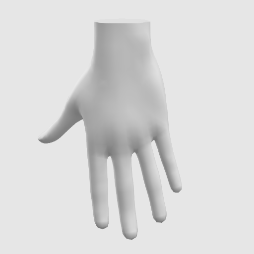

# Generic hand

Generic hand model from the [`webxr-input-profile`](https://github.com/immersive-web/webxr-input-profiles) repository, licensed under the MIT license (http://creativecommons.org/licenses/by/4.0/).

# Usage Notes
 * All joints need to be translated and rotated based on the hand input pose data.
